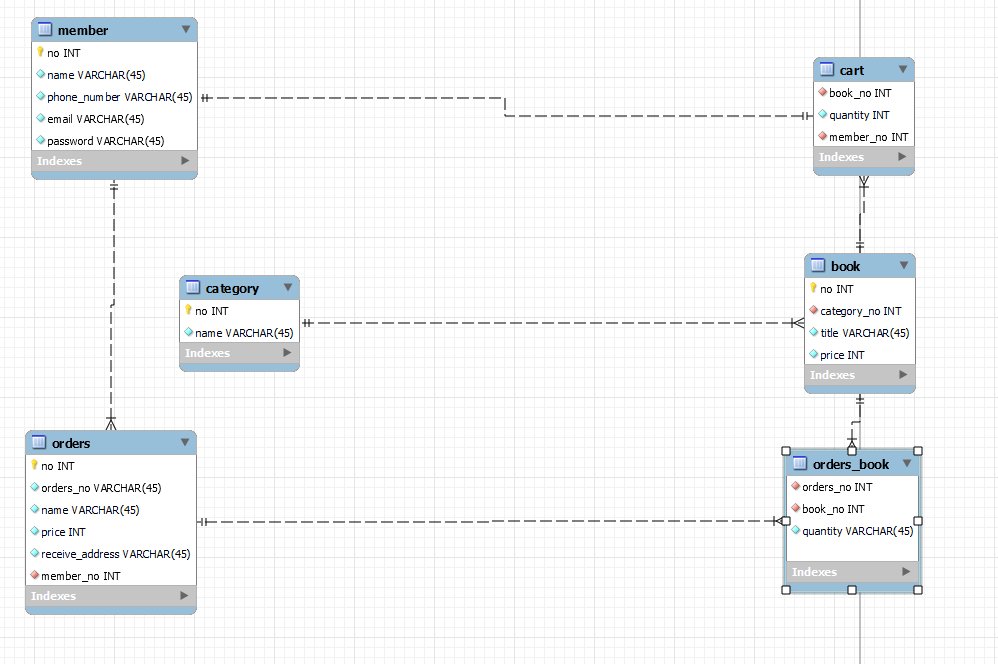

```text
평가과제 ----

수업 -03 - 평과과제
온라인 서점 (workbech)
1. 딴거 하지말고 하라는거만 하시오.
2. 카테고리, 서적(제목, 가격)
   고객(이름, 전화번호, 이메일, 비밀번호)
   카트 (도서제목, 수량, 가격)
   주문(주문번호, 주문자이름or메일), 결제금액, 배송지)

bookmall.dao
bookmall.vo
bookmall.dao.test
bookmall.main -> 이친구만 최종 실행 예정


1. 회원 2명
   이름, 전화번호, 이메일, 비밀번호
2. 카테고리 3개
   소설, 수필, 컴퓨터/IT, 인문, 경제, 예술
3. 상품 3개
   제목, 가격
4. 카트 2개
   도서제목, 수량, 가격
5. 주문 1개
   주문번호, 주문자(이름/이메일), 결제금액, 배송지
6. 주문 도서 2개
   도서번호, 도서제목, 수량


코드 안보고 결과 리스트만 볼 예정

```

<br/>

---

# 📃Diagram

### 회원 `member`

🔜 1:1 member_no -> member.no

* **이름, 전화번호, 이메일, 비밀번호**
* `no`_(🔑 *, Auto)_, `name`, `phone_number`, `email`, `password`

<br/>

### 카테고리 `category`

* 소설, 수필, 컴퓨터/IT, 인문, 경제, 예술
* `no`_(🔑 *, Auto)_, `nmae`

<br/>

### 상품 `book`

🔜 category_no -> category.no

* 제목, 가격
* `no`_(🔑 *, Auto)_, `category_no`, `title`, `price`

<br/>

### 카트 `cart`

🔜 **1:1** member_no -> member.no   
🔜 book_no -> book.no

* 도서제목, 수량, 가격
* `member_no`, `book_no`, `quantity`

  <br/>

### 주문 `orders`

🔜 member_no -> member.no

* 주문번호, 주문자(이름/이메일), 결제금액, 배송지
* `no`_(🔑 *, Auto)_, `orders_number`, `name`,`price`, `receive_address`, 🔜 **member_no**

<br/>

### 주문 도서 `order_book`

🔜 orders_no -> orders.no  
🔜 book_no -> book.no

* 도서번호, 도서제목, 수량
* `orders_no`, `book_no`, `quantity`

<br/>




<br/>

```mysql
mysql -u root -p
```

```mysql
create databasse bookmall;
```

```mysql
create user 'bookmall'@'192.168.%' identified by 'bookmall';
```

```mysql
grant all privileges on bookmall.* to 'bookmall'@'192.168.%';
```

```mysql
flush privileges; 
```
```mysql
mysql -u bookmall -D bookmall -p
```


